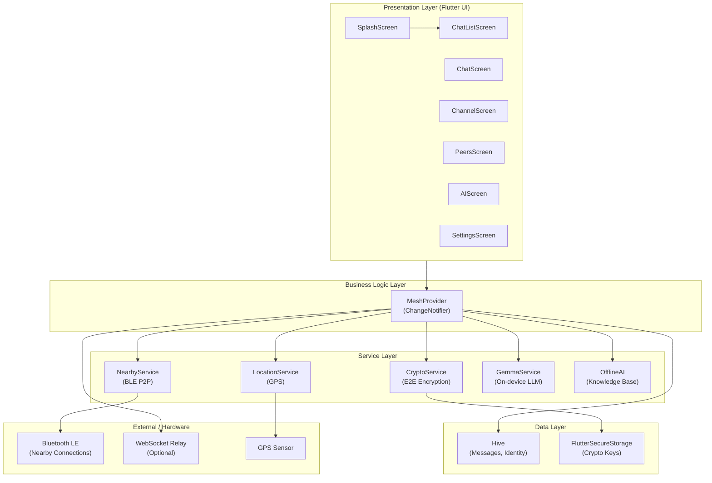
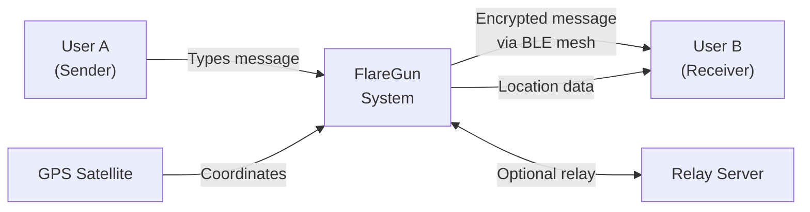
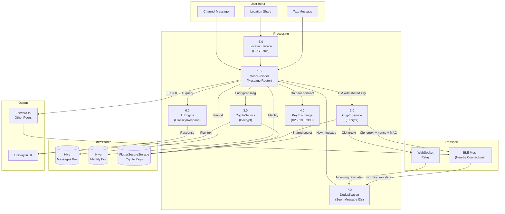

# FlareGun — Final Presentation Report

**Portable AI-Assisted Offline Communication System Using Decentralized Mesh Networking**

---

## 1. System Architecture



### Layer Descriptions

| Layer | Purpose | Components |
|-------|---------|------------|
| **Presentation** | User interface, navigation, animations | 7 screens built with Flutter Material |
| **Business Logic** | State management, message routing, peer lifecycle | `MeshProvider` (single ChangeNotifier) |
| **Service** | Communication, encryption, location, AI | 5 specialized services |
| **Data** | Persistent storage | Hive (messages), FlutterSecureStorage (keys) |
| **External** | Hardware interfaces | Bluetooth LE, WebSocket, GPS |

---

## 2. Data Flow Diagram

### Level 0 — Context Diagram



### Level 1 — Detailed DFD



---

## 3. Module Breakdown

### 3.1 Mesh Networking (`NearbyService`)
- Uses **Google Nearby Connections API** with `P2P_CLUSTER` strategy
- Simultaneous advertising and discovery via Bluetooth LE
- Auto-accepts incoming connections
- Sends UTF-8 encoded JSON payloads between endpoints

### 3.2 Message Routing (`MeshProvider`)
- Central state manager using Flutter's `ChangeNotifier` pattern
- **Multi-hop forwarding**: Each message has a TTL (Time-to-Live = 7 hops). When a message is received, if TTL > 0, it is forwarded to all other connected endpoints with TTL decremented by 1
- **Deduplication**: A `LinkedHashSet` of message IDs (capped at 500) prevents processing the same message twice
- **Message types**: `message`, `receipt`, `key_exchange`, `location`, `channel`
- **Conversations**: Stored per peer ID for DMs, per `channel:<name>` for group chats

### 3.3 End-to-End Encryption (`CryptoService`)

| Step | Algorithm | Purpose |
|------|-----------|---------|
| Key Generation | X25519 | Generate asymmetric key pair on first launch |
| Key Exchange | ECDH (X25519) | Derive shared secret when two peers connect |
| Key Ratcheting | HKDF-SHA256 | Derive a new symmetric key per message (forward secrecy) |
| Encryption | AES-256-GCM | Encrypt plaintext with authenticated encryption |
| Verification | FNV-1a Hash | Generate 6-digit safety number from combined public keys |

**Wire format**: `[4B counter][12B nonce][16B MAC][ciphertext]` → base64 encoded

### 3.4 On-Device AI

| Component | Type | Function |
|-----------|------|----------|
| `OfflineAI` | Rule-based | Keyword matching against 15+ disaster categories with weighted scores |
| `GemmaService` | Neural (Gemma 3 1B) | On-device LLM for conversational disaster assistance |

- AI runs **entirely offline** — no internet required
- Gemma model downloaded once, runs on-device GPU via MediaPipe
- Knowledge base covers: earthquakes, floods, fires, medical emergencies, shelter, water purification, signaling

### 3.5 Location Sharing (`LocationService`)
- GPS with `LocationAccuracy.high` (3-5m outdoor accuracy)
- Coordinates formatted as `12.9716°N, 77.5946°E`
- Google Maps URL generated for when internet is available

### 3.6 Group Channels
- Named channels (e.g., "Medical Team", "Search Party")
- Messages scoped to channel via `channel` field on `MeshMessage`
- Auto-join on receiving a channel message from mesh
- Forwarded through mesh like broadcast but stored separately

---

## 4. Technologies and Methods

| Technology | Version | Purpose |
|-----------|---------|---------|
| **Flutter** | 3.41.2 | Cross-platform mobile framework |
| **Dart** | 3.x | Programming language |
| **Google Nearby Connections** | 4.3.0 | BLE peer-to-peer communication |
| **cryptography (Dart)** | 2.7.0 | X25519, AES-256-GCM, HKDF |
| **flutter_secure_storage** | 9.2.4 | OS-level encrypted key storage (Android Keystore) |
| **Hive** | 2.2.3 | Lightweight NoSQL for messages and identity |
| **Geolocator** | 13.0.2 | GPS positioning |
| **flutter_gemma** | 0.12.4 | On-device Gemma 3 LLM inference |
| **Provider** | 6.1.5 | State management (ChangeNotifier) |
| **Node.js** | — | Optional WebSocket relay server |

### Design Patterns Used

| Pattern | Where | Why |
|---------|-------|-----|
| **Observer** | `ChangeNotifier` + `Provider` | UI reacts to state changes automatically |
| **Store-and-Forward** | `MeshProvider._relayToOthers()` | Messages hop through intermediate nodes |
| **Strategy** | `P2P_CLUSTER` | Nearby Connections cluster topology for mesh |
| **Singleton** | Service instances in `MeshProvider` | One crypto, location, AI instance per app |
| **Factory** | `MeshMessage.fromJson()` | Deserialize messages from wire format |

---

## 5. Security Analysis

| Threat | Protection | Standard |
|--------|-----------|----------|
| Eavesdropping | AES-256-GCM encryption | Same as Signal, WhatsApp |
| Key compromise | HKDF per-message ratcheting | Forward secrecy |
| Key storage theft | Android Keystore via FlutterSecureStorage | Hardware-backed |
| MITM attack | 6-digit safety number verification | Trust-on-first-use (TOFU) |
| Message replay | Unique UUID per message + seen-set deduplication | Standard practice |
| Data retention | 24-hour auto-expiry | Privacy by design |
| Relay snooping | E2E encryption — relay sees only ciphertext | Zero-knowledge relay |

---

## 6. File Structure

```
meshlink_app/lib/
├── main.dart                    (App entry, theme, navigation)
├── ai/
│   ├── gemma_service.dart       (On-device LLM)
│   └── offline_ai.dart          (Rule-based knowledge base)
├── models/
│   ├── identity.dart            (Device UUID + name)
│   ├── message.dart             (MeshMessage with encryption, location, channel fields)
│   └── peer.dart                (Peer model with connection state)
├── screens/
│   ├── splash_screen.dart       (Animated launch screen)
│   ├── chat_list_screen.dart    (Conversation list)
│   ├── chat_screen.dart         (1-on-1 chat with glassmorphism)
│   ├── channel_screen.dart      (Group channels with color coding)
│   ├── peers_screen.dart        (Radar mesh visualization)
│   ├── ai_screen.dart           (AI assistant interface)
│   └── settings_screen.dart     (Stats, security, identity)
└── services/
    ├── mesh_provider.dart       (Central state + message routing)
    ├── nearby_service.dart      (BLE communication)
    ├── crypto_service.dart      (E2E encryption)
    └── location_service.dart    (GPS positioning)
```

**Total: 17 Dart files across 5 directories**

---

## 7. Expected Viva Questions and Answers

### Architecture

**Q1: Why did you choose Flutter over native Android?**
Flutter allows cross-platform development with a single codebase. For a disaster app, reaching both Android and iOS users maximizes impact. Flutter's widget system also enabled the custom radar animation and glassmorphism effects efficiently.

**Q2: Why is MeshProvider a single ChangeNotifier instead of multiple providers?**
In a mesh network, all state is interconnected — peers affect conversations, encryption depends on peer connections, channels depend on messages. A single provider avoids synchronization bugs between multiple state objects. The Provider package rebuilds only the widgets that depend on changed state.

**Q3: How does multi-hop message forwarding work?**
Each message has a TTL (Time-to-Live) starting at 7. When Node B receives a message from Node A, it checks: (1) Has it seen this message ID before? If yes, drop it. (2) Is TTL > 0? If yes, decrement TTL by 1, increment hop count, and forward to all connected endpoints except the source. This allows messages to reach nodes not directly connected to the sender.

**Q4: What happens if two nodes are not directly connected?**
If Node A is connected to Node B, and Node B is connected to Node C, then A's message reaches C through B (multi-hop relay). The TTL of 7 means a message can travel up to 7 hops, covering a wide area in a mesh topology.

### Encryption

**Q5: Explain the key exchange process.**
When two devices connect via Bluetooth, each sends a `key_exchange` message containing their X25519 public key. The receiving device performs ECDH (Elliptic Curve Diffie-Hellman) to derive a shared secret. Both devices independently compute the same shared secret without ever transmitting it.

**Q6: What is forward secrecy and how did you implement it?**
Forward secrecy means that compromising a current key does not compromise past messages. We use HKDF (HMAC-based Key Derivation Function) to derive a unique encryption key for each message from the base shared secret and a counter. Even if an attacker obtains key N, they cannot derive keys 0 through N-1.

**Q7: How is AES-GCM different from AES-CBC?**
AES-GCM provides both confidentiality (encryption) and integrity (authentication) in a single operation. AES-CBC only provides confidentiality — you need a separate HMAC for integrity. GCM generates a MAC (Message Authentication Code) that detects any tampering with the ciphertext.

**Q8: Where are the encryption keys stored?**
Private keys are stored in `FlutterSecureStorage`, which uses Android Keystore on Android and Keychain on iOS. These are hardware-backed secure enclaves — the keys cannot be extracted even with root access on most devices.

**Q9: What is the safety number and how does it prevent MITM?**
The safety number is a 6-digit code generated from the hash of both parties' public keys. If an attacker performs a man-in-the-middle attack, they would have different public keys, resulting in different safety numbers. Users can compare numbers in person to verify no MITM occurred.

### Networking

**Q10: Why Bluetooth LE and not WiFi Direct?**
BLE is lower power consumption (critical in disaster when charging is impossible), has wider device compatibility, and the Nearby Connections API handles connection management automatically. WiFi Direct requires more manual setup and drains battery faster.

**Q11: What is the P2P_CLUSTER strategy?**
P2P_CLUSTER allows a device to simultaneously advertise its presence and discover other devices. This creates a mesh topology where any node can connect to any other node, unlike P2P_STAR which requires a central hub.

**Q12: What is the role of the WebSocket relay server?**
The relay is optional and supplements the BLE mesh when internet is available. It extends range beyond Bluetooth limits. The relay sees only encrypted ciphertext, so it cannot read message contents — this is zero-knowledge relaying.

**Q13: How do you handle message deduplication?**
A `LinkedHashSet` stores the last 500 message UUIDs. When a message arrives, we check if its ID is in the set. If yes, the message is dropped. This prevents infinite forwarding loops in the mesh where Node A forwards to B, B forwards to C, and C forwards back to A.

### AI

**Q14: How does the AI work without internet?**
Two AI systems work offline: (1) A rule-based keyword classifier with 15+ weighted disaster categories — this runs instantly. (2) Google Gemma 3 (1 billion parameter LLM) running on-device via MediaPipe — this handles conversational queries about disaster survival, first aid, and emergency procedures.

**Q15: What is the Gemma 3 model and why 1B parameters?**
Gemma 3 is Google's lightweight LLM designed for on-device inference. The 1B parameter variant fits in mobile memory (quantized to int8) and runs on mobile GPUs. Larger models would not fit in RAM or would be too slow for real-time responses.

### Privacy and Security

**Q16: How does the 24-hour message expiry work?**
On app launch, `_purgeExpiredMessages()` iterates through all conversations and removes messages whose timestamp is more than 24 hours old. This is then persisted to Hive storage. This ensures sensitive disaster communications do not persist on devices indefinitely.

**Q17: Can the relay server read the messages?**
No. Messages are encrypted end-to-end before being sent. The relay server sees only base64-encoded ciphertext. It has no access to the shared secret key, which is derived locally on each device via ECDH.

### Location

**Q18: How accurate is the GPS and what are its limitations?**
We use `LocationAccuracy.high` which provides 3-5 meter accuracy outdoors using GPS hardware. Limitations: (1) Indoors accuracy drops to 10-30 meters, (2) GPS requires clear sky view, (3) First fix can take 10+ seconds on cold start. We set a 10-second timeout.

### General

**Q19: What makes this different from WhatsApp or Telegram?**
WhatsApp and Telegram require internet connectivity and centralized servers. FlareGun works completely offline via Bluetooth mesh networking — no cell towers, no WiFi, no servers needed. In a disaster where infrastructure is destroyed, FlareGun still works.

**Q20: What are the limitations of this system?**
(1) Bluetooth range is limited to ~100 meters per hop. (2) Maximum throughput is lower than WiFi. (3) The mesh requires physical proximity between at least some nodes. (4) The Gemma LLM requires initial download over internet. (5) No persistent identity verification beyond TOFU.

**Q21: How would you scale this to a city-wide deployment?**
(1) Increase TTL for wider message propagation. (2) Add WiFi Direct as a secondary transport for higher bandwidth. (3) Deploy fixed relay nodes at strategic locations (hospitals, shelters). (4) Implement geographic message routing to reduce unnecessary forwarding.

**Q22: What were the biggest technical challenges?**
(1) Ensuring encryption key exchange works reliably over Bluetooth's intermittent connections. (2) Preventing message flooding in the mesh while ensuring delivery. (3) Running an LLM on mobile hardware with acceptable latency. (4) Managing Bluetooth permissions across Android versions.
